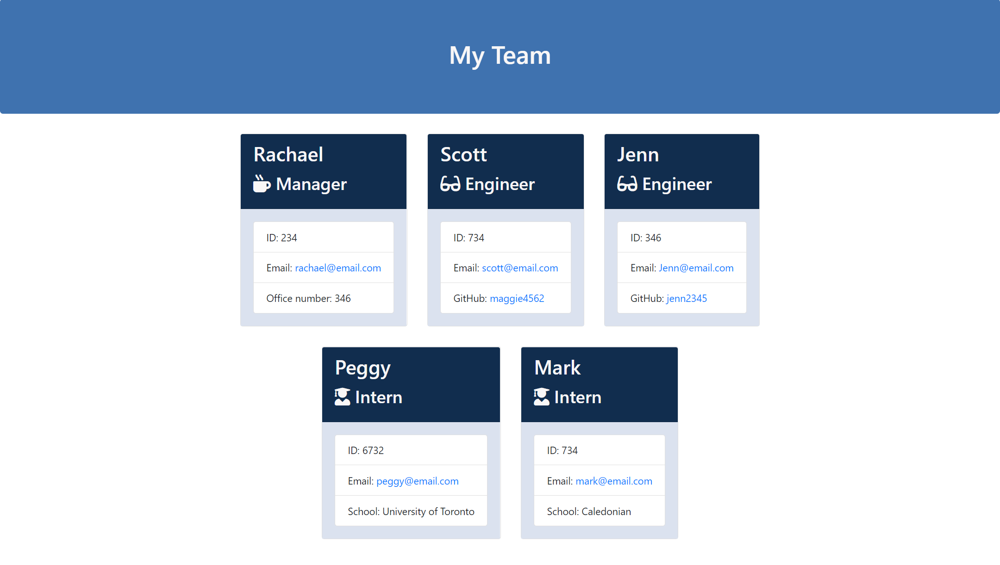

# Employee Information Generator

## About the Project

This project's aim was to build a Node CLI that takes in information about employees and generates an HTML webpage that displays summaries for each person. Since testing is a key piece in making code maintainable, I made sure that all unit tests pass. **HTML, Node.JS, and Inquirer**

### Features
    * Uses inquirer to guide user through different channels of questions.
    * Takes user input and generates an aesthetically pleasing HTML page displaying the infomration entered.  

### Screenshots

## Video 
A video of the application functionality can be found here: https://drive.google.com/file/d/1WEvl6rWIPUCha0Pu1EvrcMwOjXahmNNL/view
 
## Installation
So that your node_modules directory isn't tracked or uploaded to GitHub. Be sure to create your .gitignore file before installing any npm dependencies.

Make sure that your repo includes a package.json with the required dependencies. You can create one by running npm init when you first set up the project, before installing any dependencies.

Finally, run npm install in order to install the following npm package dependencies as specified in the package.json: inquirer that will prompt you for your inputs from the command line, jest that will help you run your test with the command npm run test.

The application itself can be invoked by running the command node app.js.

## Author
Author: Rachael McIlhagga  
Twitter: @mcilhaggis

## License
This source code is available to all and the project is licensed under the MIT License - see the LICENSE.md file for details

## Badges

